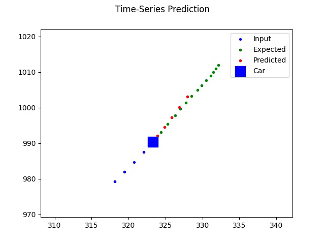

# Object Trajectory Prediction for Autonomous Vehicles



## About:

In this project, we are motivated by self-driving vehicles operating in a dynamic and uncertain environment. To be more specific, we focused on the urban traffic scene where the road is shared by a set of distinct agents like cars, pedestrians and cyclists. Self-driving vehicles require accurate and precise future trajectories prediction of the surrounding agents, where a trajectory is referred to as a sequence of x-y points. However, due to the stochastic nature of each agent’s
future behaviour, predicting future trajectories becomes a relatively complicated
process.

To enable us to model a more realistic trajectory prediction, we trained and evaluated our approach using a well-established public autonomous driving dataset, the nuScenes dataset. The team has attempted various ways to improve the evaluation results of the model, such as experimenting on different model designs, trying different normalization techniques and increasing the modality of the model by incorporating more input features. The evaluation results were then compared with those from the state-of-the-art prediction models, and have shown a reasonable evaluation score.

## Goal:
Predict the 3 seconds future trajecotries of vehicles (Cars, Vans and Trucks) in the nuScenes dataset

For more details, you can read our [report](https://drive.google.com/file/d/125xHuyXsAMSlXQ6Ikl8ptZoB03nBhRwB/view?usp=sharing)

### Install

```bash
git clone https://github.com/hatsumikana/Trajectory_Prediction_Using_nuScenes_Dataset.git  # clone
pip install -r requirements.txt  # install
```

### Train
```python
python3 train.py
```

### Evaluation
```python
python3 evaluate.py
```

## Results
<table>
    <thead>
        <tr>
            <th> Approach </th>
            <th> One Step </th>
            <th> Look Ahead </th>
        </tr>
    </thead>
    <tbody>
        <tr>
            <td rowspan=1>Multi Task LSTM without Normalization</td>
            <td><b>ADE:</b> 14.233 <b>FDE:</b> 14.233 </td>
            <td><b>ADE:</b> 698.29 <b>FDE:</b> 698.29 </td>
        </tr>
        <tr>
            <td rowspan=1>Normalization across whole training and validation dataset between -1 and 1 </td>
            <td><b>ADE:</b> 5.332  <b>FDE:</b> 5.332 </td>
            <td><b>ADE:</b> 79.999  <b>FDE:</b> 79.999 </td>
        </tr>
        <tr>
            <td rowspan=1>Normalization initialized on every instance between 0 and 1</td>
            <td><b>ADE:</b> 0.9839 <b>FDE:</b> 0.9839  </td>
            <td><b>ADE:</b> 4.9409 <b>FDE:</b> 4.9409 </td>
        </tr>
        <tr>
            <td rowspan=1>Sequence length 4 with normalization initialized on every instance between -1 and 1</td>
            <td><b>ADE:</b> 0.7373  <b>FDE:</b> 0.7373 </td>
            <td><b>ADE:</b> 3.1019 <b>FDE:</b> 3.1019 </td>
        </tr>
        <tr>
            <td rowspan=1>Sequence length 6 with normalization initialized on every instance between -1 and 1</td>
            <td><b>ADE:</b> 0.6629 <b>FDE:</b> 0.6629 </td>
            <td><b>ADE:</b> 2.923 <b>FDE:</b> 2.923 </td>
        </tr>
        <tr>
            <td rowspan=1>Sequence length 8 with normalization initialized on every instance between -1 and 1</td>
            <td><b>ADE:</b> 0.829 <b>FDE:</b> 0.829 </td>
            <td><b>ADE:</b> 4.176 <b>FDE:</b> 4.176 </td>
        </tr>
        <tr>
            <td rowspan=1>Increased modality by including the z translation and heading angle </td>
            <td><b>ADE:</b> 1.3113  <b>FDE:</b> 1.3113 </td>
            <td><b>ADE:</b> 5.7129 <b>FDE:</b> 5.7129 </td>
        </tr>
        <tr>
            <td colspan=3><center><b>Existing Solutions</b></center></td>
        </tr>
        <tr>
            <td rowspan=1 >MTP   </td>
            <td colspan=2><b>ADE:</b> 4.42 <b>FDE:</b> 10.36</td>
        </tr>
        <tr>
            <td rowspan=1 >CoverNet   </td>
            <td colspan=2><b>ADE:</b> 3.87  <b>FDE:</b> 9.26</td>
        </tr>
    </tbody>
</table>


